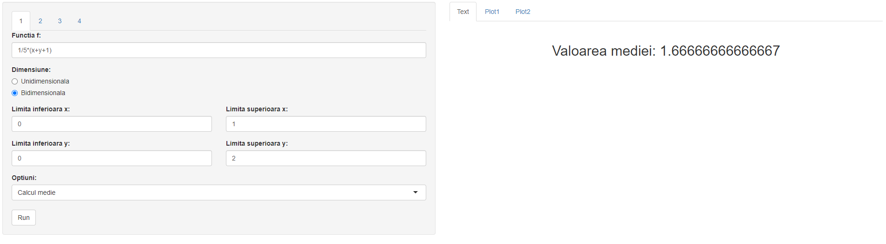
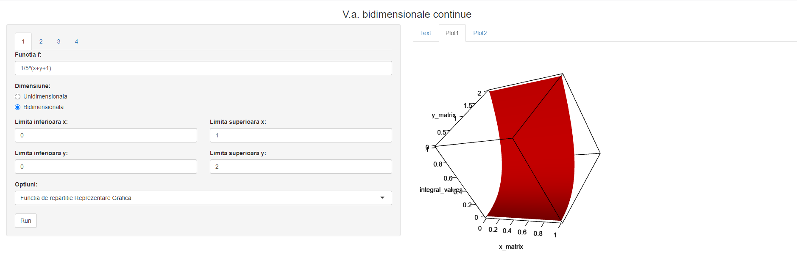
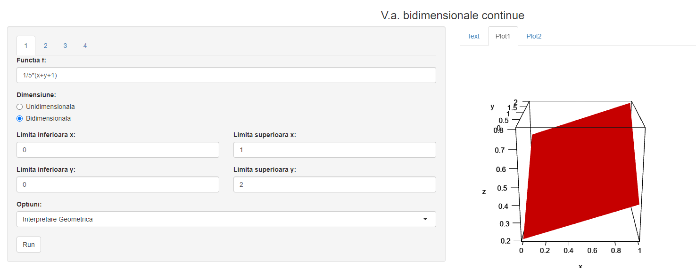

 # Probabilistics and Statistics Project

## **Table of contents:**
- [Description](#description)
- [Features](#features)
- [Contributors](#contributors)
- [Usage](#usage)
- [Gallery](#gallery)

# Description
Made using R and afferent packages. (Shiny, pracma, animate, rgl)

This project contains a library that supports diverse probability computations for bidimensional discrete random variables and a library + user interface that supports computations and 
graph plotting of unidimensional/bidimensional continuous random variables.

# Features

### Discrete random variables

- [X] Function that generates an incomplete table that represents the joint distribution of 2 discrete random variables.
- [X] Function that completes the incomplete joint distribution.
- [X] Function that extracts the marginal distribution of the 2 variables based on the joint distribution.
- [X] Function that computes the mean, variance and covariance of a random variable based on a joint distribution that contains it.
- [X] Function that computes a probability of a random variable conditioned by another based on their joint distribution.
- [X] Function that computes a probability of 2 random variables based on their joint distribution. 

### Continuous random variables and interface

- [X] Parsing of a function given as input in the app.
- [X] Option to check if the [Fubini's theorem](https://en.wikipedia.org/wiki/Fubini%27s_theorem) can be applied on the given function.
- [X] Geometrical plotting of the function
- [X] Option to check if the given function is a density function.
- [X] Option to compute the conditioned probability in a fixed point of one of the 2 random variables.
- [X] Option to compute the mean, variance and the moments for one continuous random variable.
- [X] Option to compute probabilities of one or two one continuous random variables.
- [X] Option to compute the covariance and the correlation coeficient of the 2 continuous random variables.
- [X] Option to make these computations on a single continuous random variable. 

# Gallery

## Mean computation

## Plotting

# Contributors
- [Huma Stefan](https://github.com/Steven23X)
- [Razvan Gabroveanu](https://github.com/GabroveanuRazvan)
